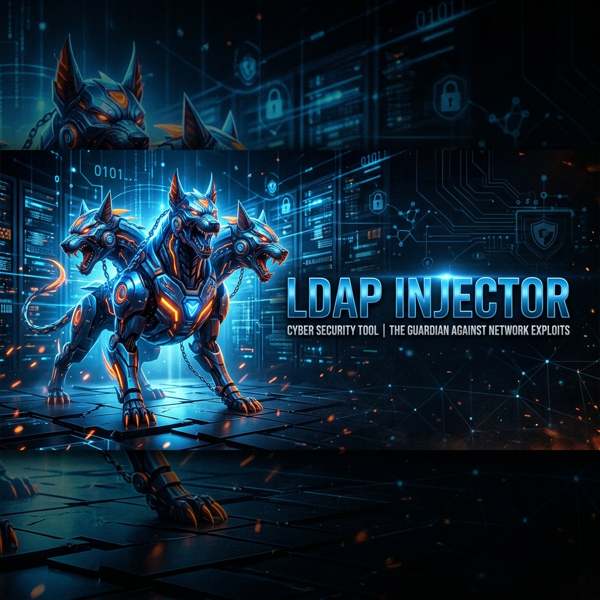

# LDAP-Injector



LDAP-Injector is an enterprise-grade, modular security testing tool designed to identify and verify LDAP injection vulnerabilities in web applications. It implements advanced detection techniques, including timing oracles, boolean differentials, and out-of-band (OOB) callbacks, while maintaining high precision through statistical significance testing.

## Features

- **Modular Architecture**: Clean separation of core logic (payloads, extraction, detection, intelligence).
- **Polymorphic WAF Bypass**: Adaptive mutation chains to evade signature-based defenses.
- **Target-Aware Payloads**: Context-sensitive injection based on backend directory schema (AD vs. OpenLDAP).
- **Stateful Exploitation**: Tracks second-order vulnerabilities and chained exploit states.
- **Precision Verification**: Three-step verification process to eliminate false positives.
- **Professional Reporting**: Structured JSON findings and detailed HTML reports with PoCs.

## Architecture

- `core/payloads.py`: Advanced payload generation and mutation.
- `core/extraction.py`: Blind data exfiltration and schema enumeration.
- `core/detection.py`: Multi-signal detection pipeline.
- `core/intelligence.py`: Control plane for adaptive scanning and correlation.
- `core/engine.py`: Orchestration of the injection process.

## Usage

```bash
python main.py https://target-app.com --threads 10 --budget 1000
```

## Contributing

We welcome contributions! Please see [CONTRIBUTING.md](CONTRIBUTING.md) for details.

## Disclaimer

This tool is for educational and ethical security testing purposes only. Always obtain explicit permission before testing any target.
